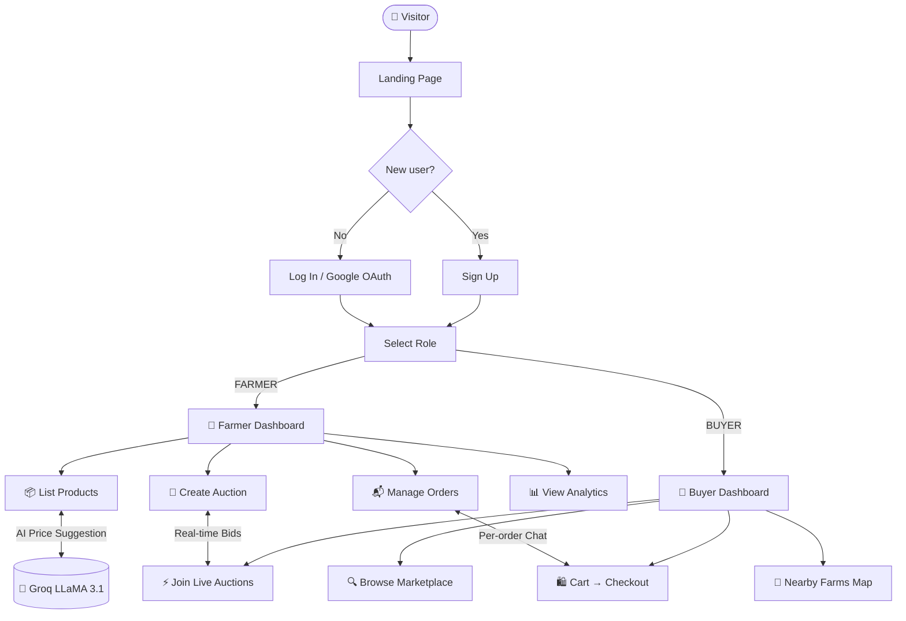
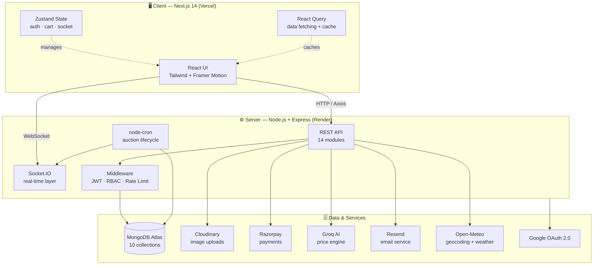
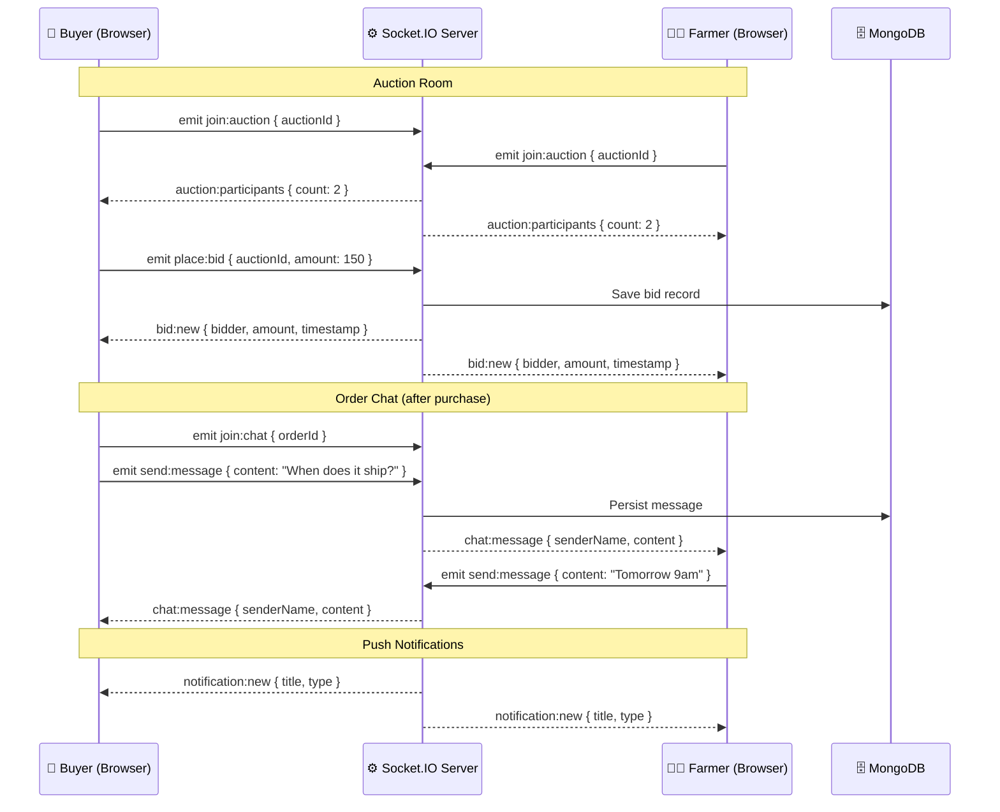
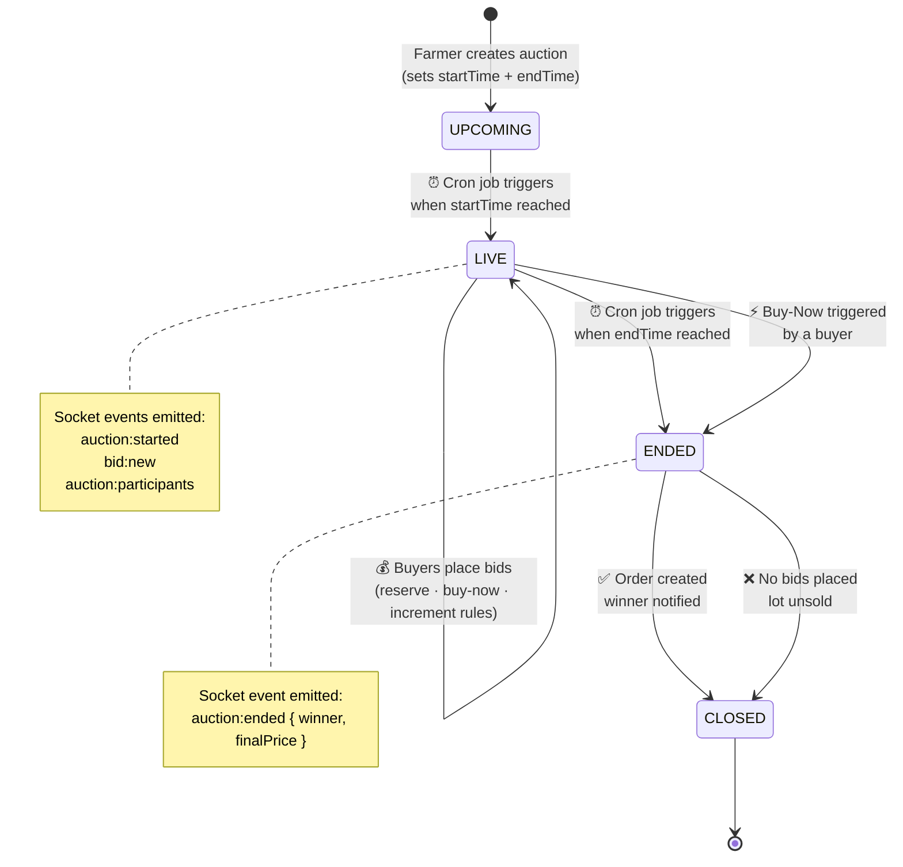
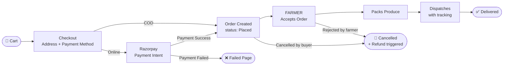
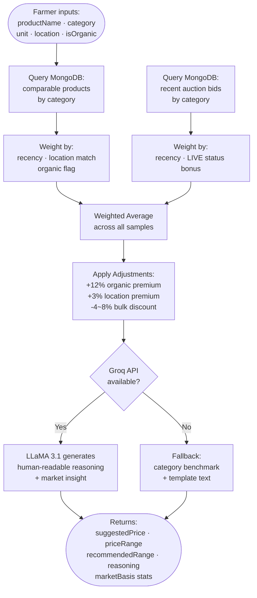

<div align="center">

# 🌾 AgroVista

**A full-stack B2B agriculture marketplace — connecting Indian farmers and bulk buyers directly, with real-time auctions, AI-powered pricing, and end-to-end order tracking.**


> *Farmers earn what they deserve. AgroVista connects verified farmers directly to bulk buyers through a transparent marketplace and real-time auctions — cutting out every middleman in between.*

🚀 **[Live Demo → agrovista-beryl.vercel.app](https://agrovista-beryl.vercel.app)**

</div>

---

## 📋 Table of Contents

- [The Problem](#-the-problem)
- [Key Features](#-key-features)
- [Feature Deep-Dive](#-feature-deep-dive)
- [User Flow](#-how-it-works--user-flow)
- [System Architecture](#-system-architecture)
- [Real-Time Architecture](#-real-time-architecture-socketio)
- [Auction Lifecycle](#-auction-lifecycle)
- [Order Pipeline](#-order-pipeline)
- [AI Pricing Engine](#-ai-pricing-engine)
- [Tech Stack](#-tech-stack)
- [Database Schema](#-database-schema)
- [API Reference](#-api-reference)
- [Project Structure](#-project-structure)
- [Quick Start](#-quick-start)
- [Environment Variables](#-environment-variables)
- [Deployment](#-deployment)
- [Security](#-security)
- [Performance](#-performance)
- [Troubleshooting](#-troubleshooting)
- [Roadmap](#-roadmap)
- [Contributing](#-contributing)

---

## 🌱 The Problem

India's agricultural supply chain is plagued by intermediaries. A farmer who grows tomatoes at ₹8/kg watches them sell for ₹40/kg in the market — the 5x markup goes entirely to mandis, commission agents, and brokers, not the grower. Farmers have no price visibility, no direct buyer access, and no negotiating power.

AgroVista fixes this with a zero-commission digital marketplace that gives farmers:

- **Price transparency** via AI-driven market benchmarks
- **Direct buyer access** with no gatekeepers
- **Competitive pricing** through real-time auctions
- **Operational control** over listings, orders, and logistics

---

## ✨ Key Features

| Role | Capability |
|------|-----------|
| 👨‍🌾 **Farmer** | List crops with Cloudinary image uploads · Run timed live auctions · Receive AI price suggestions benchmarked against market data · Analytics dashboard (revenue, orders, views) · Real-time weather widget via Open-Meteo · Verified farmer badge · Per-order chat with buyers |
| 🛒 **Buyer** | Browse and filter live product catalog · Real-time auction bidding with buy-now and reserve-price support · Cart and Razorpay checkout (online + COD) · Live order status tracking · Interactive Leaflet.js nearby-farms map · Wishlist management · Per-order chat with farmers |
| 🔐 **Both Roles** | JWT access/refresh token auth · Google OAuth 2.0 one-click login · Real-time in-app push notifications · Role-based access control (RBAC) on every route · Rate-limited API · Transactional email via Resend |

---

## 🔍 Feature Deep-Dive

### 🔨 Live Auctions

Auctions are created by farmers with a start time, end time, minimum reserve price, optional buy-now price, and bid increment amount. A `node-cron` job fires every minute to transition auction states (`UPCOMING → LIVE → ENDED → CLOSED`). All bid activity and participant counts are broadcast in real-time via Socket.IO rooms. If no bids are received before end time, the lot is marked unsold and the farmer is notified.

### 🤖 AI Pricing Engine

When a farmer creates a listing or auction, they can request an AI price suggestion. The engine:

1. Queries MongoDB for comparable products in the same category, weighted by recency and location proximity.
2. Queries recent auction bids for the same category, with a bonus weight for currently-LIVE auctions.
3. Computes a weighted average baseline price.
4. Applies adjustment factors: +12% for organic certification, +3% for same-region buyers, -4–8% for bulk quantity discounts.
5. Sends the computed price, context stats, and a structured prompt to Groq's LLaMA 3.1 API, which returns human-readable market reasoning.
6. Falls back to a category benchmark + template text if Groq is unavailable.

### 💬 Per-Order Chat

Every fulfilled order automatically creates an isolated Socket.IO room (`chat:{orderId}`) for the farmer and buyer. Messages are persisted to MongoDB and loaded on reconnect, giving both parties a reliable communication channel tied directly to the transaction. Images can also be sent via Cloudinary upload.

### 📊 Farmer Analytics Dashboard

The analytics module aggregates revenue over time (daily/weekly/monthly), top-performing products by sales volume, order status distribution, and auction win rates — all rendered with Recharts. Data is fetched on-demand and cached by TanStack React Query.

### 🗺 Nearby Farms Map

The buyer-facing map uses Leaflet.js with OpenStreetMap tiles. Farmers' locations (lat/lng from their profile) are plotted as interactive markers. Buyers can filter by crop category and distance radius to find local supply.

### 🔔 Real-Time Notifications

Every significant event — a new bid, auction win, order status change, new chat message, farmer verification approval — triggers a Socket.IO `notification:new` event to the affected user's personal room and simultaneously persists the notification to MongoDB so it survives page refresh.

---

## 🗺 How It Works — User Flow



---

## 🏗 System Architecture



---

## ⚡ Real-Time Architecture (Socket.IO)



Socket.IO rooms used across the platform:

| Room Pattern | Purpose |
|---|---|
| `auction:{auctionId}` | Real-time bid broadcast + participant count |
| `chat:{orderId}` | Per-order buyer–farmer messaging |
| `user:{userId}` | Personal push notifications |

---

## 🔨 Auction Lifecycle



The `auctionCron.js` job runs on a `* * * * *` schedule (every minute). It queries for auctions where `status === 'UPCOMING' && startTime <= now` to flip them LIVE, and `status === 'LIVE' && endTime <= now` to close them. On close, it creates an Order document and emits `auction:ended` to all room participants.

---

## 📦 Order Pipeline



**Order statuses:** `Placed → Accepted → Packed → Dispatched → Delivered` (or `Cancelled` / `Rejected` at early stages). Each transition fires an email via Resend and a real-time notification via Socket.IO.

---

## 🤖 AI Pricing Engine



**Pricing response shape:**

```json
{
  "suggestedPrice": 42.50,
  "priceRange": { "min": 36.00, "max": 49.00 },
  "recommendedRange": { "low": 40.00, "high": 46.00 },
  "reasoning": "Tomatoes in Pune are currently trading 14% above the seasonal average due to reduced supply from Nashik. Your organic certification adds a further premium...",
  "marketBasis": {
    "samplesUsed": 18,
    "avgListingPrice": 38.20,
    "avgAuctionPrice": 44.10,
    "dataFreshnessDays": 7
  }
}
```

---

## 🛠 Tech Stack

### Frontend — `client/`

| Library | Version | Role |
|---------|---------|------|
| Next.js (App Router) | 14 | Framework, SSR, file-based routing |
| Tailwind CSS | 3 | Utility-first styling |
| Framer Motion | 12 | Page transitions and micro-animations |
| Zustand | 5 | Global state — auth, cart, socket, notifications |
| TanStack React Query | 5 | Server-state caching and background refetching |
| Socket.IO Client | 4 | Real-time bidding, chat, push alerts |
| Recharts | 3 | Revenue and analytics charts |
| Leaflet.js | 1.9 | Interactive nearby-farms map |
| React Hook Form + Zod | — | Forms with schema validation |
| Axios | 1 | HTTP client with auto JWT injection via interceptor |
| Sonner | — | Toast notifications |
| next-themes | — | Dark/light theme switching |
| clsx + tailwind-merge | — | Conditional class name utilities |
| lucide-react | — | Icon library |
| canvas-confetti | — | Auction win celebration 🎉 |

### Backend — `server/`

| Library | Version | Role |
|---------|---------|------|
| Express.js | 4 | REST API (14 route modules) |
| Mongoose | 8 | MongoDB ODM with indexed schemas |
| Socket.IO | 4 | WebSocket server with JWT auth middleware |
| Passport.js | 0.7 | Google OAuth 2.0 strategy |
| Cloudinary SDK | 1 | Image upload and CDN delivery |
| Multer | 2 | Multipart/form-data file handling |
| Razorpay SDK | 2 | Payment order creation and webhook verification |
| Groq SDK | 1 | LLaMA 3.1 for AI pricing narration |
| node-cron | 4 | Auction lifecycle scheduler (every minute) |
| Resend + Nodemailer | — | Transactional and fallback email |
| bcryptjs | 2 | Password hashing (12 rounds) |
| jsonwebtoken | 9 | JWT signing and verification (access + refresh) |
| express-rate-limit | 7 | Per-IP API rate limiting |
| helmet | 7 | HTTP security headers |
| cors | 2 | Cross-origin resource sharing |
| morgan | 1 | HTTP request logging |

---

## 🗄 Database Schema

AgroVista uses **10 MongoDB collections**. Below is a concise field reference for each.

### `users`
```
_id, name, email, password (hashed), role (FARMER|BUYER),
avatar, phone, address { street, city, state, pincode },
location { lat, lng }, isVerified, verificationBadge,
googleId, refreshToken, createdAt, updatedAt
```

### `products`
```
_id, farmer (ref: users), name, description, category,
images [Cloudinary URLs], unit (kg|quintal|ton|piece),
pricePerUnit, minOrderQty, availableQty, isOrganic,
location { state, district }, status (ACTIVE|INACTIVE|SOLD_OUT),
views, ratings { avg, count }, createdAt, updatedAt
```

### `auctions`
```
_id, farmer (ref: users), product (ref: products),
title, description, images, startTime, endTime,
reservePrice, buyNowPrice, bidIncrement,
status (UPCOMING|LIVE|ENDED|CLOSED),
currentHighestBid, currentWinner (ref: users),
totalBids, participants [userId],
winnerId, finalPrice, orderId (ref: orders),
createdAt, updatedAt
```

### `bids`
```
_id, auction (ref: auctions), bidder (ref: users),
amount, timestamp, isWinningBid
```

### `orders`
```
_id, buyer (ref: users), farmer (ref: users),
items [{ product, qty, pricePerUnit, subtotal }],
totalAmount, paymentMethod (ONLINE|COD),
paymentStatus (PENDING|PAID|FAILED|REFUNDED),
razorpayOrderId, razorpayPaymentId,
deliveryAddress { street, city, state, pincode },
status (Placed|Accepted|Packed|Dispatched|Delivered|Cancelled|Rejected),
statusHistory [{ status, timestamp, note }],
auctionId (optional ref: auctions),
createdAt, updatedAt
```

### `messages`
```
_id, order (ref: orders), sender (ref: users),
senderRole (FARMER|BUYER), content, readAt, createdAt
```

### `notifications`
```
_id, user (ref: users), title, body,
type (BID|ORDER|AUCTION|CHAT|SYSTEM|VERIFICATION),
isRead, relatedId, relatedModel, createdAt
```

### `reviews`
```
_id, reviewer (ref: users), farmer (ref: users),
product (ref: products), order (ref: orders),
rating (1–5), comment, images, createdAt
```

### `wishlists`
```
_id, user (ref: users), products [ref: products], updatedAt
```

### `pricehistory`
```
_id, category, productName, price, unit,
location { state }, source (LISTING|AUCTION),
recordedAt
```

---

## 📡 API Reference

Base URL: `https://<your-render-url>/api`

All protected routes require `Authorization: Bearer <access_token>`.

### Auth — `/api/auth`

| Method | Endpoint | Auth | Description |
|--------|----------|------|-------------|
| POST | `/register` | ❌ | Register with email + password, select role |
| POST | `/login` | ❌ | Login, returns `accessToken` + `refreshToken` |
| POST | `/refresh` | ❌ | Exchange refresh token for new access token |
| POST | `/logout` | ❌ | Invalidate refresh token |
| GET | `/google` | ❌ | Redirect to Google OAuth consent screen |
| GET | `/google/callback` | ❌ | OAuth callback, sets tokens and redirects to dashboard |
| GET | `/me` | ✅ | Return current user profile |

### Products — `/api/products`

| Method | Endpoint | Auth | Description |
|--------|----------|------|-------------|
| GET | `/` | ❌ | List all active products (filters: category, location, minPrice, maxPrice, isOrganic, search) |
| GET | `/:id` | ❌ | Get single product detail + farmer info |
| GET | `/:id/price-history` | ❌ | Get price history for a product |
| POST | `/` | ✅ FARMER | Create listing (multipart/form-data with images) |
| PUT | `/:id` | ✅ FARMER | Update own listing |
| DELETE | `/:id` | ✅ FARMER | Soft-delete own listing |
| GET | `/farmer/mine` | ✅ FARMER | Farmer's own product listings |

### Auctions — `/api/auctions`

| Method | Endpoint | Auth | Description |
|--------|----------|------|-------------|
| GET | `/` | ❌ | List auctions (filter by status: UPCOMING, LIVE, ENDED) |
| GET | `/:id` | ❌ | Get auction detail + bid history |
| POST | `/` | ✅ FARMER | Create new auction (multipart/form-data with single image) |
| DELETE | `/:id` | ✅ FARMER | Cancel upcoming auction |
| POST | `/:id/bid` | ✅ BUYER | Place a bid |
| POST | `/:id/checkout` | ✅ BUYER | Initiate checkout after winning (buy-now or auction end) |
| POST | `/orders/:orderId/payment` | ✅ BUYER | Create Razorpay payment for auction order |
| POST | `/orders/:orderId/verify-payment` | ✅ BUYER | Verify Razorpay payment for auction order |
| GET | `/farmer/mine` | ✅ FARMER | Farmer's own auctions |

### Orders — `/api/orders`

| Method | Endpoint | Auth | Description |
|--------|----------|------|-------------|
| POST | `/` | ✅ BUYER | Place a new order directly |
| GET | `/buyer` | ✅ BUYER | Buyer's order history |
| GET | `/farmer` | ✅ FARMER | Farmer's incoming orders |
| GET | `/my-orders` | ✅ | All orders for the current user (any role) |
| GET | `/:id` | ✅ | Get order details (own orders only) |
| PATCH | `/:id/status` | ✅ FARMER | Update order status |
| PATCH | `/:id/verify` | ✅ BUYER | Verify delivery received |
| POST | `/:id/cancel` | ✅ BUYER | Cancel order (Placed status only) |

### Checkout — `/api/checkout`

| Method | Endpoint | Auth | Description |
|--------|----------|------|-------------|
| POST | `/create-order` | ✅ BUYER | Create Razorpay order from cart, returns Razorpay order ID |

### Payments — `/api/payments`

| Method | Endpoint | Auth | Description |
|--------|----------|------|-------------|
| POST | `/create` | ✅ BUYER | Create a Razorpay payment order |
| POST | `/verify` | ✅ BUYER | Verify Razorpay signature, mark payment PAID |
| POST | `/webhook` | ❌ | Razorpay webhook handler (HMAC verified) |

### Chat — `/api/chat`

| Method | Endpoint | Auth | Description |
|--------|----------|------|-------------|
| GET | `/:orderId` | ✅ | Load message history for an order |
| POST | `/:orderId` | ✅ | Send a message (also emitted via Socket.IO; supports image upload) |
| DELETE | `/:orderId/clear` | ✅ | Clear all messages for an order |

### Analytics — `/api/analytics`

| Method | Endpoint | Auth | Description |
|--------|----------|------|-------------|
| GET | `/farmer` | ✅ FARMER | Revenue, orders, top products, auction stats |

### AI — `/api/ai`

| Method | Endpoint | Auth | Description |
|--------|----------|------|-------------|
| POST | `/price-advisor` | ✅ FARMER | Get AI price suggestion for a product |

### Other Modules

| Module | Base Path | Key Endpoints |
|--------|-----------|---------------|
| Users | `/api/users` | `GET /stats`, `GET /:id`, `GET /:id/reviews`, `PATCH /me`, `PUT /me/role`, `DELETE /me`, `POST /me/verification-request`, `POST /me/verification-upload` |
| Reviews | `/api/reviews` | `GET /:farmerId`, `POST /:farmerId` (BUYER) |
| Wishlist | `/api/wishlist` | `GET /`, `POST /:productId`, `DELETE /:productId`, `GET /:productId/check` |
| Notifications | `/api/notifications` | `GET /` (paginated), `PATCH /:id/read`, `PATCH /read-all` |

---

## 📁 Project Structure

```
agrovista/
│
├── client/                              # Next.js 14 App Router
│   ├── app/
│   │   ├── page.jsx                     # Landing page
│   │   ├── layout.js                    # Root layout with providers
│   │   ├── globals.css
│   │   ├── api/
│   │   │   └── weather/route.js         # Next.js API route for weather proxy
│   │   ├── login/page.jsx
│   │   ├── signup/page.jsx
│   │   ├── select-role/page.jsx         # Post-signup role selection
│   │   ├── auth/callback/page.jsx       # Google OAuth callback handler
│   │   ├── forgot-password/page.jsx
│   │   ├── reset-password/page.jsx
│   │   ├── profile/page.jsx             # Public farmer profile view
│   │   ├── settings/page.jsx            # Account settings
│   │   ├── messages/page.jsx            # Messaging inbox
│   │   ├── notifications/page.jsx
│   │   ├── products/
│   │   │   ├── page.jsx                 # Marketplace catalog
│   │   │   ├── [id]/page.jsx            # Product detail
│   │   │   ├── create/page.jsx          # Create new listing (FARMER)
│   │   │   ├── edit/page.jsx            # Edit existing listing (FARMER)
│   │   │   └── my-listings/page.jsx     # Farmer's own listings
│   │   ├── auctions/
│   │   │   ├── page.jsx                 # Auction listing
│   │   │   ├── [id]/page.jsx            # Live auction room
│   │   │   ├── create/page.jsx          # Create new auction (FARMER)
│   │   │   └── checkout/page.jsx        # Auction winner checkout
│   │   ├── dashboard/
│   │   │   ├── farmer/page.jsx          # Farmer dashboard
│   │   │   └── buyer/page.jsx           # Buyer dashboard
│   │   ├── orders/
│   │   │   ├── page.jsx                 # Order list
│   │   │   └── [id]/page.jsx            # Order detail + chat
│   │   ├── cart/page.jsx
│   │   └── checkout/
│   │       ├── page.jsx                 # Standard cart checkout
│   │       ├── success/page.jsx         # Payment success
│   │       └── failed/page.jsx          # Payment failed
│   │
│   ├── components/
│   │   ├── ui/                          # Reusable UI primitives (Badge, Button, Card, Dialog, Input, Select, RawImage)
│   │   ├── chat/                        # ChatBubbles, ChatContainer
│   │   ├── dashboard/                   # CategoryDonut, RevenueChart, TopProducts, WeatherWidget
│   │   ├── map/                         # NearbyFarmsMap (Leaflet wrapper)
│   │   ├── orders/                      # OrderDetailContent
│   │   └── shared/                      # Header, Sidebar
│   │
│   ├── store/
│   │   ├── authStore.js                 # User session + JWT
│   │   ├── cartStore.js                 # Cart items (persisted to localStorage)
│   │   ├── socketStore.js               # Socket.IO connection singleton
│   │   └── notificationStore.js         # In-app notification queue
│   │
│   ├── lib/
│   │   ├── api.js                       # Axios instance + request/response interceptors
│   │   ├── socket.js                    # Socket.IO client factory
│   │   └── utils.js                     # Utility helpers
│   │
│   └── providers/
│       └── AppProviders.jsx             # QueryClient + Theme + Auth wrappers
│
└── server/                              # Node.js + Express
    ├── index.js                         # Server entry point
    └── src/
        ├── app.js                       # Express app setup, middleware, route mounting
        ├── modules/
        │   ├── auth/                    # register, login, refresh, logout + oauth.routes.js (Google)
        │   ├── users/                   # profile CRUD, verification flow, admin endpoints
        │   ├── products/                # listing CRUD, image upload, price history
        │   ├── auctions/                # auction CRUD, bid placement, checkout flow
        │   ├── orders/                  # order management, status transitions
        │   ├── checkout/                # cart → Razorpay order creation
        │   ├── payments/                # Razorpay create, verify + webhook
        │   ├── analytics/               # farmer analytics aggregation
        │   ├── chat/                    # order message persistence + image support
        │   ├── reviews/                 # farmer reviews
        │   ├── wishlist/                # buyer wishlist CRUD
        │   ├── notifications/           # notification read/unread management
        │   └── ai/                      # Groq-powered price advisor
        │
        ├── models/
        │   ├── User.js
        │   ├── Product.js
        │   ├── Auction.js
        │   ├── Bid.js
        │   ├── Order.js
        │   ├── Message.js
        │   ├── Notification.js
        │   ├── Review.js
        │   ├── Wishlist.js
        │   └── PriceHistory.js
        │
        ├── config/
        │   ├── db.js                    # Mongoose connection
        │   ├── socket.js                # Socket.IO server init + JWT handshake
        │   ├── passport.js              # Google OAuth strategy
        │   └── cloudinary.js            # Cloudinary SDK init + Multer storage
        │
        ├── middleware/
        │   ├── auth.js                  # JWT verify → req.user
        │   ├── authorize.js             # RBAC — authorize('FARMER') etc.
        │   └── rateLimiter.js           # express-rate-limit config
        │
        ├── jobs/
        │   └── auctionCron.js           # Every-minute auction state machine
        │
        └── services/
            └── email.service.js         # Resend + Nodemailer abstraction
```

---

## ⚡ Quick Start

### Prerequisites

- **Node.js** v18+
- **MongoDB Atlas** account — [free tier at mongodb.com/atlas](https://www.mongodb.com/atlas)

### 1. Clone

```bash
git clone https://github.com/anshul-636/agrovista.git
cd agrovista
```

### 2. Backend Setup

```bash
cd server
npm install
cp .env.example .env   # fill in your values (see below)
npm run dev            # starts on http://localhost:5000
```

### 3. Frontend Setup

Open a second terminal:

```bash
cd client
npm install

# Create client/.env.local
echo "NEXT_PUBLIC_API_URL=http://localhost:5000/api" > .env.local
echo "NEXT_PUBLIC_SOCKET_URL=http://localhost:5000" >> .env.local

npm run dev   # starts on http://localhost:3000
```

### 4. Verify

| Check | Expected result |
|-------|----------------|
| `GET localhost:5000/health` | `{ "status": "ok" }` |
| `http://localhost:3000` | Landing page loads |
| Sign up as FARMER | Redirects to `/dashboard/farmer` |
| Sign up as BUYER | Redirects to `/dashboard/buyer` |
| Socket.IO | `connected` log in browser console |

---

## 🔑 Environment Variables

### Server — `server/.env`

```env
# ── Core ──────────────────────────────────────────────────────────────────────
MONGODB_URI="mongodb+srv://<user>:<pass>@cluster.mongodb.net/agrovista"
# The full Atlas connection string including database name

JWT_SECRET="your_64_byte_random_hex"
# Used to sign access tokens (short-lived, 15 min)
# Generate with: node -e "console.log(require('crypto').randomBytes(64).toString('hex'))"

JWT_REFRESH_SECRET="your_other_64_byte_random_hex"
# Used to sign refresh tokens (long-lived, 7 days)

PORT=5000
CLIENT_URL="http://localhost:3000"
# Exact origin allowed by CORS — no trailing slash

NODE_ENV="development"
# Set to "production" in deployed environments

# ── Image Uploads ──────────────────────────────────────────────────────────────
CLOUDINARY_CLOUD_NAME="..."
CLOUDINARY_API_KEY="..."
CLOUDINARY_API_SECRET="..."
# All three are in Cloudinary Dashboard → Settings → Access Keys

# ── AI Pricing ────────────────────────────────────────────────────────────────
GROQ_API_KEY="gsk_..."
# Free at console.groq.com — used for LLaMA 3.1 price narration
# If absent, the system falls back to template-based pricing text

# ── Google OAuth ──────────────────────────────────────────────────────────────
GOOGLE_CLIENT_ID="..."
GOOGLE_CLIENT_SECRET="..."
# Create at console.cloud.google.com → APIs & Services → Credentials

GOOGLE_CALLBACK_URL="http://localhost:5000/api/auth/google/callback"
# Must match an Authorized Redirect URI in Google Cloud Console exactly

SESSION_SECRET="..."
# Used by express-session for the Passport.js OAuth flow
# Any long random string

# ── Email ─────────────────────────────────────────────────────────────────────
RESEND_API_KEY="re_..."
# Free at resend.com — used for order and auction transactional emails

EMAIL_FROM="AgroVista <onboarding@resend.dev>"
# Sender name and address shown in outgoing emails

ADMIN_EMAILS="admin@youremail.com"
# Comma-separated list of admin emails for farmer verification requests

# ── Payments ──────────────────────────────────────────────────────────────────
RAZORPAY_KEY_ID="rzp_test_..."
RAZORPAY_KEY_SECRET="..."
# Both from Razorpay Dashboard → Settings → API Keys
# Use test keys locally; switch to live keys in production
```

### Client — `client/.env.local`

```env
NEXT_PUBLIC_API_URL="http://localhost:5000/api"
# Base URL for all Axios requests; replace with Render URL in production

NEXT_PUBLIC_SOCKET_URL="http://localhost:5000"
# Base URL for Socket.IO connection; replace with Render URL in production
```

---

## 🚀 Deployment

### Frontend → Vercel

1. Import `agrovista/client` (set root directory to `client`) at [vercel.com](https://vercel.com).
2. Add environment variables:
   - `NEXT_PUBLIC_API_URL` — your Render backend URL (e.g. `https://agrovista-api.onrender.com/api`)
   - `NEXT_PUBLIC_SOCKET_URL` — same base URL without `/api`
3. Deploy. Vercel will build with `next build` automatically.

### Backend → Render

1. New **Web Service** at [render.com](https://render.com), root directory: `server`.
2. Build command: `npm install` · Start command: `npm start`
3. Add all environment variables from the table above.
4. Set `NODE_ENV=production` and `CLIENT_URL=<your Vercel URL>`.
5. Google OAuth: add `https://<render-url>/api/auth/google/callback` as an Authorized Redirect URI in Google Cloud Console.
6. Razorpay: add your production webhook URL `https://<render-url>/api/payments/webhook` in the Razorpay Dashboard.

> **Note on Render's free tier:** Render spins down idle services after 15 minutes. The first request after inactivity may take 30–60 seconds. Consider upgrading to a paid plan for production use.

---

## 🔒 Security

| Layer | Mechanism |
|-------|-----------|
| Authentication | JWT access tokens (15 min) + refresh tokens (7 days), stored in HTTP-only cookies on the client |
| Authorisation | RBAC middleware — every route specifies required role(s); mismatched roles return `403` |
| Password storage | bcryptjs with 12 salt rounds |
| Payment integrity | Razorpay HMAC-SHA256 signature verification on every webhook and client-side payment confirmation |
| Socket.IO | JWT verified on every connection handshake; unauthenticated sockets are disconnected immediately |
| Rate limiting | `express-rate-limit` — login: 8 req/15 min · register: 5 req/1 hr · token refresh: 20 req/15 min · global API: 120 req/min (all per IP) |
| HTTP headers | `helmet` sets `X-Content-Type-Options`, `X-Frame-Options`, `Content-Security-Policy` and others |
| Input validation | Zod schemas on the client; Mongoose schema validation + manual checks on the server |
| CORS | Strict origin whitelist — only `CLIENT_URL` is allowed |

---

## ⚡ Performance

- **React Query caching** — product lists, auction data, and farmer analytics are cached client-side with configurable stale times, minimising redundant network requests.
- **MongoDB indexes** — compound indexes on `products.category + status`, `auctions.status + startTime`, and `orders.buyer + status` keep query times low at scale.
- **Cloudinary transformations** — product and avatar images are served via Cloudinary's CDN with automatic `f_auto,q_auto` (format and quality optimisation).
- **Socket.IO rooms** — events are scoped to individual auction and chat rooms, preventing fan-out to unrelated connections.
- **node-cron efficiency** — the auction cron queries only documents with `status IN [UPCOMING, LIVE]`, never scanning the full collection.

---

## 🛠 Troubleshooting

**`CORS error` on the frontend**

Ensure `CLIENT_URL` in your server `.env` exactly matches the origin your frontend is served from (including protocol and port). No trailing slash.

**`Socket.IO: websocket connection failed`**

Check that `NEXT_PUBLIC_SOCKET_URL` points to the server (not `/api`) and that your hosting provider allows WebSocket connections. On Render, WebSocket is supported on all paid plans.

**`Google OAuth redirect_uri_mismatch`**

The `GOOGLE_CALLBACK_URL` in your `.env` must be listed verbatim in **Authorized Redirect URIs** under your Google Cloud OAuth 2.0 client.

**`Razorpay signature verification failed`**

Ensure `RAZORPAY_KEY_SECRET` is the secret key (not the key ID), and that your webhook handler reads the raw body, not the parsed JSON body.

**`Groq: API key invalid`**

The Groq free tier key starts with `gsk_`. Generate one at [console.groq.com](https://console.groq.com). If you leave this blank, the AI pricing module falls back gracefully — it will still return a price suggestion, just without the LLM-generated narrative.

**`Auctions not transitioning to LIVE`**

The cron job runs every minute. Check server logs for `[AuctionCron]` entries. Ensure the server's system clock is in sync (most cloud providers handle this automatically).

---

## 🗺 Roadmap

- [ ] **Mobile app** — React Native client for farmers with offline-first product listing
- [ ] **Logistics integration** — Shiprocket / Delhivery API for automated shipping label generation and live tracking
- [ ] **Multi-language support** — Hindi, Marathi, Telugu, Tamil UI localisation
- [ ] **Mandi price feed** — Live Agmarknet API integration as an additional data source for the AI pricing engine
- [ ] **Farmer credit scoring** — On-chain or internal transaction history to enable micro-credit access
- [ ] **Bulk order negotiation** — RFQ (Request for Quotation) flow for large-volume buyers
- [ ] **Video auctions** — WebRTC-based live video during auction rooms
- [ ] **Buyer analytics dashboard** — Spend tracking, category breakdown, auction win history

---

## 🤝 Contributing

Contributions are welcome! Please follow these steps:

1. **Fork** the repository.
2. **Create a branch** from `main`:
   ```bash
   git checkout -b feature/your-feature-name
   ```
3. **Commit** using conventional commits:
   ```bash
   git commit -m "feat(auctions): add reserve price tooltip"
   git commit -m "fix(chat): resolve message duplication on reconnect"
   git commit -m "docs(readme): add API reference table"
   ```
4. **Push** and open a **Pull Request** against `main`.

Please open an issue first for any significant change so we can discuss the approach before you invest time building it.

---

<div align="center">

Built with ❤️ for Indian farmers — by **[anshul-636](https://github.com/anshul-636)**

⭐ **Star this repo** if it helped you!

</div>