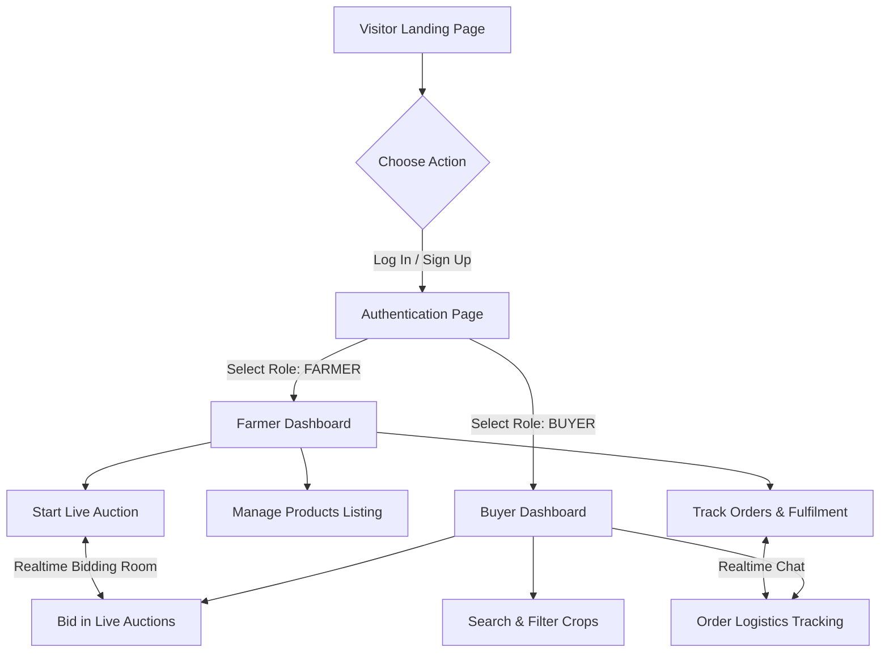

# AgroVista Frontend Developer Guide

This repository contains the complete Next.js 14 App Router frontend for **AgroVista**, a premium B2B agriculture marketplace connecting farmers and buyers directly.

---

## 🚀 Getting Started

First, install the client dependencies:

```bash
cd client
npm install
```

Start the local development server:

```bash
npm run dev
```

Open [http://localhost:3000](http://localhost:3000) to view the application.

---

## 📂 Webpage Frontend Flow

AgroVista implements a complete, modern SaaS workflow built around user roles (`FARMER` vs `BUYER`).



### 1. Route Structures
* **`/`** - Dynamic marketing landing page containing stats, live previews, and testimonials.
* **`/login` & `/signup`** - Animated forms supporting role assignment (`FARMER`/`BUYER`), password strength scoring, and OAuth simulation.
* **`/dashboard/farmer`** - Main portal for crop producers, rendering product lists, active bidding stats, weather advice modules, and Recharts analytics.
* **`/dashboard/buyer`** - Portal for commercial buyers, housing a dynamic Leaflet map of nearby farms, recommendations, and active watchlist trackers.
* **`/products`** - Search catalog featuring category filters, organic tags, price sliders, and detailed zoom cards.
* **`/auctions`** - Active auctions directory featuring live bid rooms with countdowns, increment buttons, and confetti.
* **`/orders`** - Logistics timeline trackers detailing crop processing status, linked directly to order messaging.
* **`/messages`** - Centralized chat interface supporting live communications.

---

## 🔌 API & Backend Update Flow

All API operations flow through the Axios client instance located in [client/lib/api.js](file:///c:/Users/kushw/OneDrive/Desktop/agrovista/client/lib/api.js).

### Request Interceptor (JWT Authorization)
If a user is logged in, the client stores their security token in `localStorage` under the key `agrovista_token`. The request interceptor automatically attaches this token to the `Authorization` header of all outbound HTTP calls:

```javascript
// Automatically handled by client/lib/api.js
api.interceptors.request.use((config) => {
  const token = localStorage.getItem("agrovista_token");
  if (token) {
    config.headers.Authorization = `Bearer ${token}`;
  }
  return config;
});
```

### Mock Fallback / Standalone Emulation
This project no longer includes any client-side in-memory mock databases or simulated backend engines. The frontend requires a running backend for full functionality; if the backend is unavailable the UI will show clean empty or offline states rather than synthesizing data.

---

## 📥 Required Backend API Response Formats

The frontend expects all backend responses to match a strict JSON schema envelope. 

### 1. General Envelope
Every standard JSON payload returned by the server must contain:
```json
{
  "success": true, // Boolean indicator of success status
  "data": {},      // Payload (Object, Array, or String)
  "error": null    // String error message if success is false, else null
}
```

### 2. Specific Payload Schemas

#### A. Authentication (`POST /api/auth/login` or `POST /api/auth/signup`)
```json
{
  "success": true,
  "token": "eyJhbGciOi...",
  "user": {
    "id": "farmer-123",
    "name": "Rajesh Kumar",
    "email": "rajesh@agrovista.com",
    "role": "FARMER", // Must be "FARMER" or "BUYER"
    "avatar": "https://images.unsplash.com/...",
    "location": "Nashik, Maharashtra"
  }
}
```

#### B. Crop Products List (`GET /api/products`)
```json
{
  "success": true,
  "data": [
    {
      "id": "tomato-1",
      "name": "Organic Roma Tomatoes",
      "description": "Premium sun-ripened Roma tomatoes...",
      "category": "Vegetables", // "Vegetables", "Grains", "Fruits"
      "price": 45,
      "unit": "kg", // "kg", "quintal", "ton"
      "quantity": 120,
      "images": ["https://..."],
      "isOrganic": true,
      "harvestDate": "2026-05-25",
      "farmerId": "farmer-1",
      "farmerName": "Rajesh Kumar",
      "farmerLocation": "Nashik, Maharashtra",
      "farmerTrustScore": 94,
      "reviews": [
        { "id": "r1", "reviewer": "Suresh Patel", "rating": 5, "comment": "Fresh!", "createdAt": "2026-05-26" }
      ]
    }
  ]
}
```

#### C. Create Listing (`POST /api/products`)
* **Request Body**: `{ name, description, category, price, unit, quantity, images, isOrganic, harvestDate }`
* **Response**:
```json
{
  "success": true,
  "data": {
    "id": "prod-xyz",
    "name": "...",
    "price": 45,
    "createdAt": "2026-05-27T12:00:00Z"
  }
}
```

#### D. AI Pricing Recommendation (`POST /api/ai/suggest-price`)
* **Request Body**: `{ name, category, location, unit, isOrganic }`
* **Response**:
```json
{
  "success": true,
  "data": {
    "recommendedRange": "₹42 - ₹54 per kg",
    "explanation": "Supply curves are down by 14%. Organic tags demand a premium..."
  }
}
```

#### E. Farmer Analytics Dashboard (`GET /api/analytics/farmer`)
```json
{
  "success": true,
  "data": {
    "revenueTrend": [
      { "date": "May 25", "revenue": 18500, "orders": 6 },
      { "date": "May 26", "revenue": 24300, "orders": 8 }
    ],
    "topProducts": [
      { "name": "Organic Tomatoes", "sales": 180, "revenue": 8100 }
    ],
    "categoryData": [
      { "name": "Vegetables", "value": 28650, "color": "#2E7D32" }
    ],
    "summary": {
      "thisMonthRevenue": 74800,
      "completionRate": 97.4,
      "avgOrderValue": 2450,
      "activeProducts": 6,
      "liveAuctions": 2
    }
  }
}
```

---

## ⚡ Socket.IO Real-Time Communications

Real-time interactions (auctions, chats, order updates, notifications) use WebSockets via Socket.IO client helpers in [client/lib/socket.js](file:///c:/Users/kushw/OneDrive/Desktop/agrovista/client/lib/socket.js).

If connection attempts to `process.env.NEXT_PUBLIC_SOCKET_URL` time out or fail, the client will not instantiate simulated socket engines. Real-time features depend on an available backend; the UI will present an offline state and queue no simulated events.

### WebSocket Action Map

#### 1. Live Auction Bidding Rooms
* **Join Room**: Emit `join:auction` when entering an auction page.
  ```javascript
  socket.emit("join:auction", { auctionId: "auc-1" });
  ```
* **Place Bid**: Emit `place:bid` when a buyer submits a new bid amount.
  ```javascript
  socket.emit("place:bid", {
    auctionId: "auc-1",
    amount: 105,
    bidder: "Amit Singh (Buyer)"
  });
  ```
* **Listen for Bids**: Listen to `bid:new` to sync high bids dynamically across all open screens.
  ```javascript
  socket.on("bid:new", (bidData) => {
    // bidData format: { auctionId, bidder, amount, timestamp, isUser }
  });
  ```

#### 2. Order Real-Time Chats
* **Join Chat**: Emit `join:chat` when opening an order message box.
  ```javascript
  socket.emit("join:chat", { orderId: "ord-8812" });
  ```
* **Send Message**: Emit `send:message` when typing into the chat console.
  ```javascript
  socket.emit("send:message", {
    orderId: "ord-8812",
    content: "Hi, when is the dispatch scheduled?",
    senderId: "buyer-123",
    senderName: "Amit Singh",
    senderRole: "BUYER" // "BUYER" or "FARMER"
  });
  ```
* **Listen for Messages**: Listen to `chat:message` to render new bubbles.
  ```javascript
  socket.on("chat:message", (msg) => {
    // msg format: { id, orderId, senderId, senderName, senderRole, content, createdAt }
  });
  ```

#### 3. Push Alerts & Notifications
* **Register Session**: Emit `join:user` on dashboard launch.
  ```javascript
  socket.emit("join:user", { userId: "user-998" });
  ```
* **Listen for Alerts**: Listen to `notification:new` to push Sonner toasts and increment bells.
  ```javascript
  socket.on("notification:new", (notification) => {
    // notification format: { title, description, type, createdAt }
  });
  ```

---

## 🛠 Project Environment Variables

Create a `.env.local` inside the `client/` folder to target custom API endpoints:

```env
NEXT_PUBLIC_API_URL=http://localhost:5000/api
NEXT_PUBLIC_SOCKET_URL=http://localhost:5000
```
